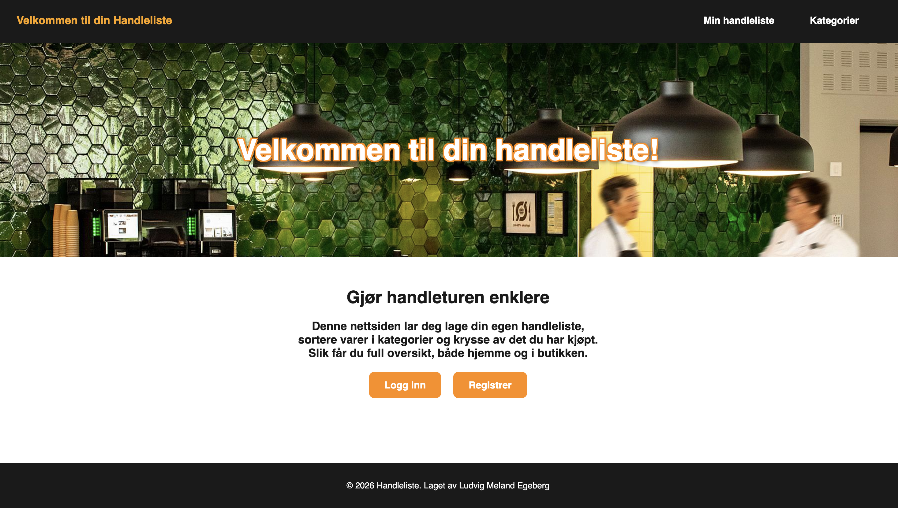

# Online handleliste

## MÅL
Jeg skal lage en handleliste som er optimalisert for alle.
Målet er å lage en hanleliste som gjøre at brukeren skal kunne skrive inn ting også lagres det i en database sånn at det blir liggende
Det skal også vere mulig å fjerne ting fra listen når det har blit kjøpt.
Lage en kategori liste.
Kunne dele lister med venner og familie

## Beskrivelse

Dette er en online handleliste.
På denne online handlelisten, så kan du lage en bruker og vær bruker har vær sin handleliste.
Du kan legge til ting i handlelisten og du kan fjerne ting fra handlelisten. Du kan også fjerne brukeren din med et klikk.
Jeg har passet på å bruke skriftyper som er lett å lese sånn at mennesker med dysleksi kan lese teksten godt. Jeg har også passet på å har farger som er lett og tydelige sånn at det er lett å se forsjel på tekst og bakrund hvis du er fargeblind.

## Kompetansemål som dekkes i prosjektet

### Kompetansemål – Utvikling

Prosjektet dekker følgende kompetansemål innen utvikling:
Lage og begrunne funksjonelle krav til en IT-løsning basert på behovskartlegging
Dette prosjektet er utviklet med utgangspunkt i brukerbehov, som behov for enkel oversikt, lagring av handlelister og et brukervennlig grensesnitt. Funksjonelle krav som å legge til, fjerne og lagre varer er definert og begrunnet før implementering.

Vurdere brukergrensesnitt til IT-tjenester og designe tjenester som er tilpasset brukernes behov
Brukergrensesnittet er designet med fokus på enkel navigasjon, tydelige valg og universell utforming, slik at løsningen er tilgjengelig for flest mulig brukere, inkludert personer med nedsatt funksjonsevne.

### Kompetansemål – Brukerstøtte

Prosjektet dekker følgende kompetansemål innen brukerstøtte:
Kartlegge behovet for og utvikle veiledninger for brukere og kunder
Det er utviklet brukerveiledning i prosjektets README som forklarer hvordan løsningen fungerer, hvordan den brukes og hvordan vanlige feil kan løses.

Utøve brukerstøtte og veilede i relevant programvare
Prosjektet er dokumentert på en måte som gjør det mulig å veilede brukere i bruk av programmet, både muntlig og skriftlig, og gi støtte ved feil eller misforståelser.

### Kompetansemål – Drift

Prosjektet dekker følgende kompetansemål innen drift:
Planlegge og dokumentere arbeidsprosesser og IT-løsninger
Arbeidet er planlagt og dokumentert gjennom bruk av GitHub, README-fil, To-do-liste og changelog som viser utvikling og endringer i prosjektet over tid.

Forenkle og automatisere arbeidsprosesser i utvikling av IT-løsninger
Løsningen automatiserer håndtering av handlelister, som ellers ofte gjøres manuelt, og bidrar til mer effektiv arbeidsflyt for brukeren.